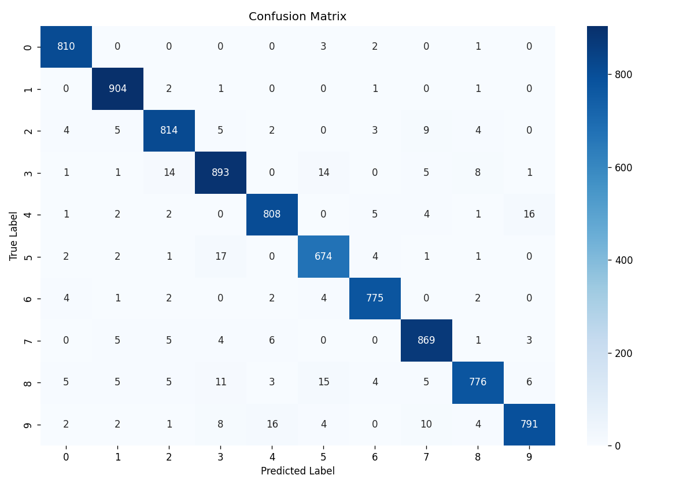
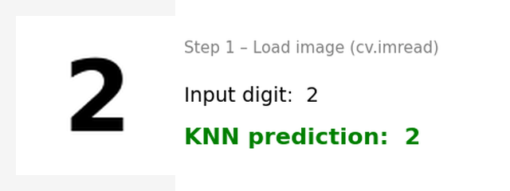

# Handwritten-Digit-Recognition

# End-to-End ML Pipeline: Handwritten Digit Recognition

## 📌 Project Overview
This project demonstrates a complete Machine Learning pipeline for recognizing handwritten digits. Instead of relying immediately on Deep Learning, this repository focuses on building a strong foundation using **Traditional Machine Learning algorithms** and optimizing them for real-world inference. 

The project goes beyond standard dataset evaluation by incorporating automated feature selection and building a custom inference script using **OpenCV** to predict user-drawn digits in real-time.

## 🚀 Key Features
- **Feature Engineering:** Implemented `RandomForestClassifier` for automated feature selection, significantly reducing dimensionality while preserving critical data patterns.
- **Algorithm Comparison:** Evaluated and compared multiple baseline models including K-Nearest Neighbors (KNN), Logistic Regression, and Naive Bayes.
- **Custom Inference Pipeline:** Integrated OpenCV (`cv2`) to preprocess, resize, and predict external, real-world images drawn by the user.

## 🛠️ Tech Stack
- **Language:** Python
- **Machine Learning:** Scikit-learn
- **Computer Vision:** OpenCV (`cv2`)
- **Data Manipulation & Visualization:** NumPy, Pandas, Matplotlib, Seaborn

## 📊 Results & Performance
The optimized **K-Nearest Neighbors (KNN)** model outperformed other traditional models, achieving an accuracy of **97%** on the test set.

*(Here, you will see the Confusion Matrix demonstrating the model's precision across all 10 digits)*
 
## 👁️ Real-World Testing
The model was successfully tested on custom, external images processed through our OpenCV pipeline:


## ⚙️ How to Run
1. Clone this repository:
   ```bash
   git clone [https://github.com/LeenDS/Handwritten-Digit-Recognition.git](https://github.com/LeenDS/Handwritten-Digit-Recognition.git)
